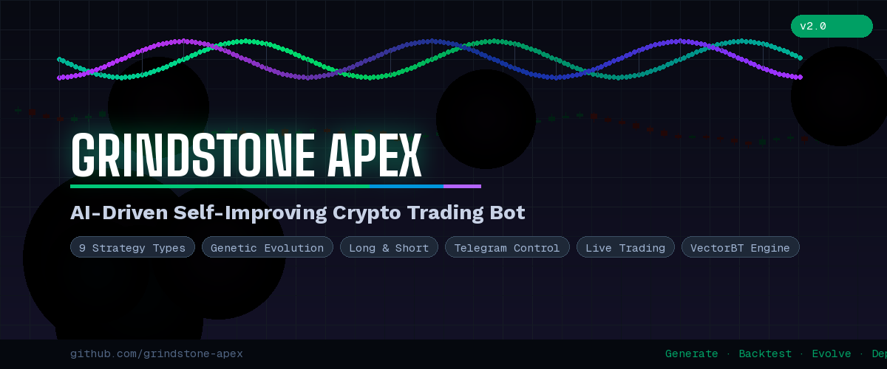
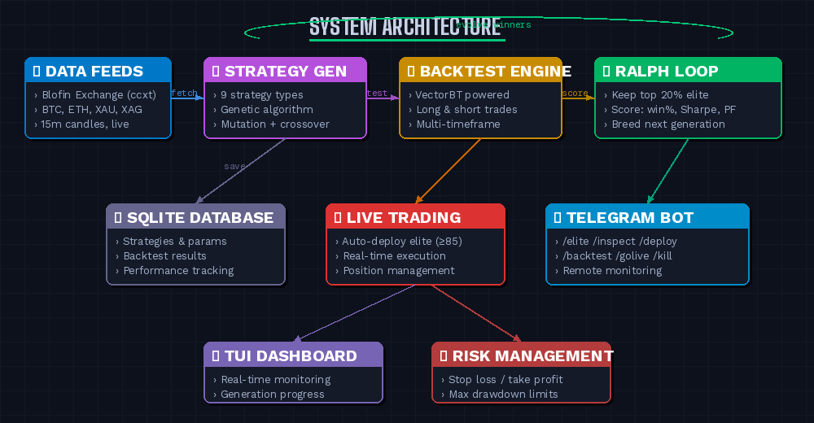

<p align="center">
  
</p>

<p align="center">
  <strong>An AI-powered crypto trading bot that generates, backtests, evolves, and deploys profitable strategies autonomously.</strong>
</p>

<p align="center">
  
  
  
  
  
</p>

---

## What is Grindstone Apex?

Grindstone Apex is a **self-improving trading system** that uses genetic algorithms to breed profitable crypto trading strategies. It generates hundreds of strategies per generation, backtests them against real market data, keeps the top performers, and breeds them to create the next generation — getting smarter with every cycle.

You control everything from your phone via a **Telegram bot**.

<p align="center">
  
</p>

---

## Key Features

**9 Strategy Types** — SMA crossover, EMA crossover, Donchian breakout, volume breakout, RSI mean reversion, Bollinger bounce, MACD, opening range breakout, and liquidity sweeps.

**Long & Short** — Every strategy can trade both directions. The genetic algorithm evolves the optimal direction for each market condition.

**The Ralph Loop** — Each generation, the top 20% of strategies survive as "elite." The bottom 80% are discarded. Elite strategies breed via crossover and mutation to create the next generation. Survival of the fittest.

**Telegram Bot** — Full remote control from your phone. Start backtests, browse elite strategies, inspect parameters, deploy to live trading, monitor positions, and emergency kill — all from Telegram.

**Live Trading** — Deploy winning strategies to Blofin exchange with real money. Auto-deploy mode pushes strategies scoring 85+ directly to live.

**VectorBT Engine** — Blazing-fast vectorized backtesting. Test 500 strategies across 4 pairs in minutes, not hours.

---

## Telegram Commands

| Command | Description |
|---------|-------------|
| `/start` | Welcome message and full command list |
| `/status` | System overview — strategies, generations, positions |
| `/elite` | Top strategies per pair with IDs and scores |
| `/inspect ID` | Full strategy details — type, params, backtest results |
| `/deploy ID` | Deploy a specific strategy to live trading |
| `/backtest` | Start a new generation of backtesting |
| `/stop` | Stop the current backtest |
| `/golive PAIR` | Auto-deploy the best strategy for a pair |
| `/stoplive PAIR` | Stop live trading for a pair |
| `/balance` | Exchange account balance |
| `/positions` | Open positions |
| `/history N` | Last N trades |
| `/kill` | Emergency: close all positions and stop everything |

---

## Supported Pairs

| Pair | Type |
|------|------|
| BTC/USDT:USDT | Bitcoin perpetual futures |
| ETH/USDT:USDT | Ethereum perpetual futures |
| XAU/USDT:USDT | Gold perpetual futures |
| XAG/USDT:USDT | Silver perpetual futures |

---

## Strategy Types

| Type | How It Works |
|------|-------------|
| **SMA Crossover** | Fast SMA crosses above/below slow SMA |
| **EMA Crossover** | Exponential moving average crossover (faster response) |
| **Donchian Breakout** | Price breaks N-period high/low channel |
| **Volume Breakout** | Volume spike above multiplier × average triggers entry |
| **RSI Mean Reversion** | RSI oversold/overbought reversals |
| **Bollinger Bounce** | Price touches Bollinger Band and reverses |
| **MACD** | MACD line crosses signal line |
| **Opening Range Breakout** | Price breaks the high/low of the first N bars |
| **Liquidity Sweep** | Price sweeps previous swing then reverses |

Each strategy also has configurable take-profit, stop-loss (ATR-based), and position sizing parameters that evolve through the genetic algorithm.

---

## Tech Stack

| Component | Technology |
|-----------|------------|
| Language | Python 3.10+ |
| Backtesting | VectorBT |
| Exchange | Blofin via ccxt |
| Database | SQLite (SQLAlchemy ORM) |
| Bot | python-telegram-bot |
| TUI | Textual + Rich |
| API | FastAPI + Uvicorn |

---

## Project Structure

```
grindstone_apex/
├── telegram_bot.py          # Telegram bot (main entry point)
├── run_backtest.py          # Standalone backtest runner
├── main.py                  # TUI + API launcher
├── .env                     # API keys and config (not committed)
├── requirements.txt         # Python dependencies
├── src/
│   ├── database.py          # SQLAlchemy models
│   ├── backtesting/
│   │   ├── vectorbt_engine.py   # Multi-strategy backtest engine
│   │   └── metrics.py          # Scoring, Sharpe, Sortino, criteria
│   ├── strategy_generation/
│   │   └── genetic_algorithm.py # GA with 9 types, mutation, crossover
│   ├── tui/
│   │   └── app.py              # Terminal UI dashboard
│   └── services/
│       └── generation_service.py # Continuous generation loop
└── assets/
    ├── banner.png
    └── architecture.png
```

---

## Quick Start

> For a detailed step-by-step guide, see **[SETUP_GUIDE.md](SETUP_GUIDE.md)**.

```bash
# 1. Clone the repo
git clone https://github.com/YOUR_USERNAME/grindstone_apex.git
cd grindstone_apex

# 2. Create virtual environment
python -m venv venv
venv\Scripts\activate        # Windows
source venv/bin/activate     # Mac/Linux

# 3. Install dependencies
pip install -r requirements.txt

# 4. Configure .env file (see SETUP_GUIDE.md)
cp .env.example .env

# 5. Run the Telegram bot
python telegram_bot.py
```

Then open Telegram and send `/backtest` to start your first generation.

---

## How the Evolution Works

```
Generation 1:  500 random strategies across 9 types
                        ↓
            Backtest all against real market data
                        ↓
            Score each: win rate, Sharpe, profit factor, drawdown
                        ↓
            Top 20% become "elite" — bottom 80% discarded
                        ↓
Generation 2:  Breed elites via crossover + mutation → 500 children
                        ↓
                   ... repeat forever ...
                        ↓
            Strategies scoring ≥85 auto-deploy to live trading
```

---

## License

MIT License. Use at your own risk. This is experimental trading software — always start with small amounts and monitor closely.

---

<p align="center">
  <strong>Generate · Backtest · Evolve · Deploy</strong>
</p>
